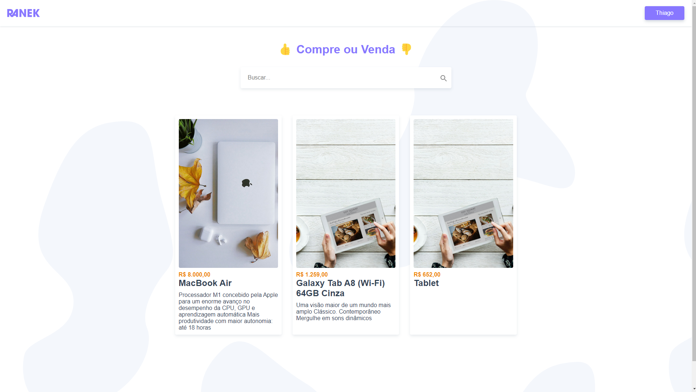
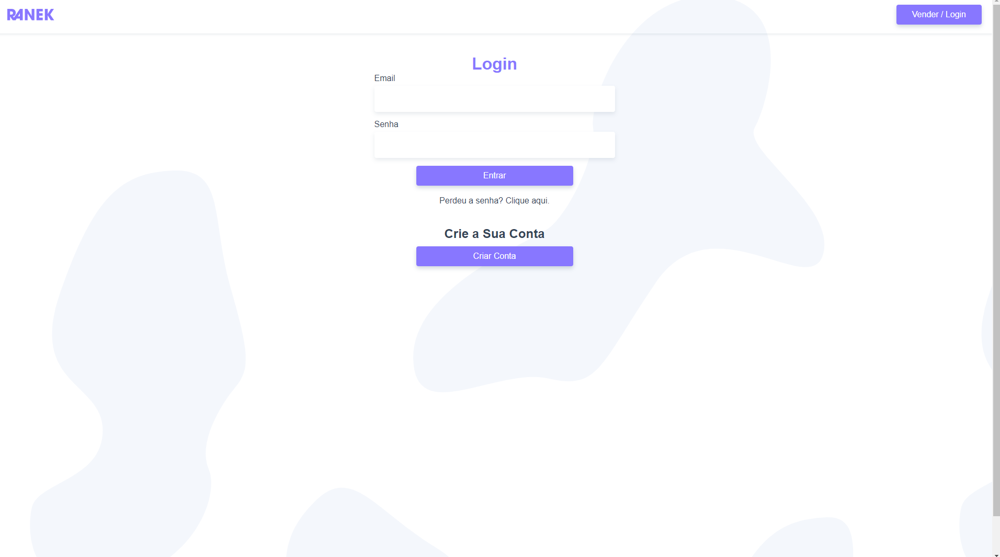
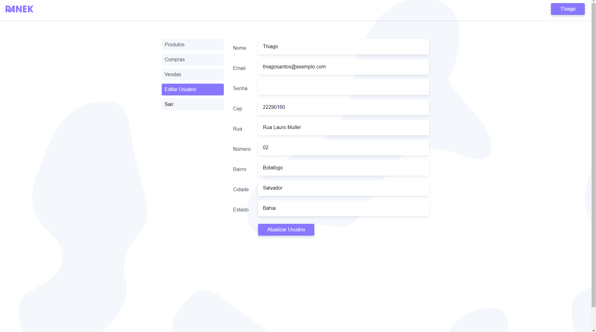
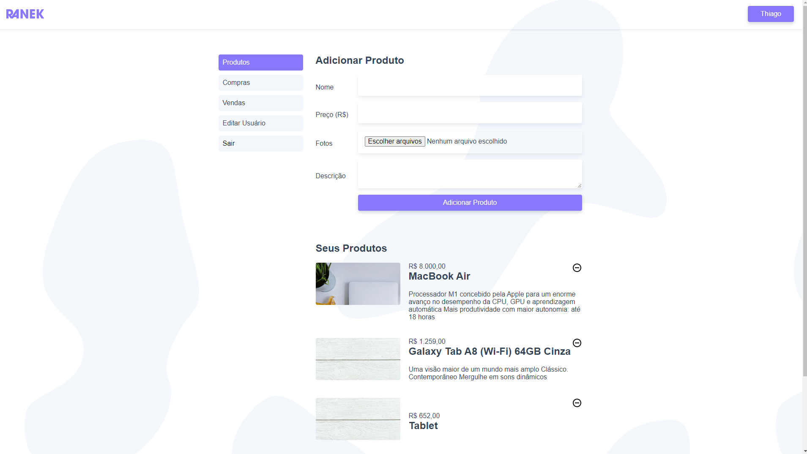
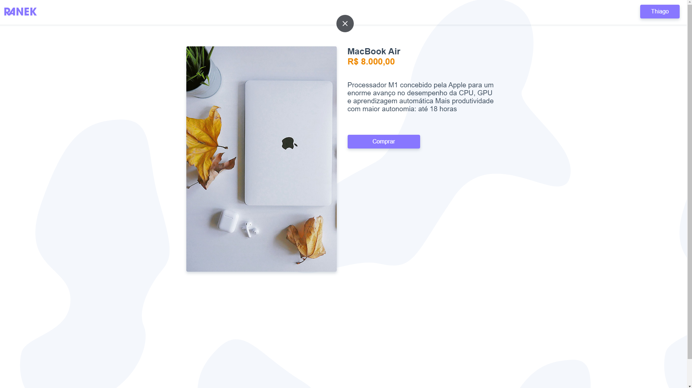

<h1 align="center" >
    
    <br>
</h1>

<h4 align="center">
  <p>Ranek</p>
  
  <p>This application was developed during the Origamind course in Vue.Js.</p>

  <p>
 In this project we built an awesome landing page from the beginning. 

  We start by creating the Style Guide. After that, we designed the UI concept. And finally we developed the page using VueJs on the Front end and to communicate with the back I created an API in WordPress.

  </p>
</h4>

<p align="center">
  
  
  
  
  
</p>

## :rocket: Technologies

This project was developed with the following technologies:

-  [JavaScript](https://developer.mozilla.org/pt-BR/docs/Web/JavaScript)
-  [Vue Js](https://vuejs.org/)
-  [CSS3](https://developer.mozilla.org/pt-BR/docs/Web/CSS)
-  [Axios](https://github.com/axios/axios)
-  [VS Code]

## :information_source: How to use

To clone and run this application, you'll need [Git](https://git-scm.com) installed on your computer. From your command line:

```bash
# Clone this repository
$ git clone https://github.com/ThiagoSantosTh/ranek.git

# Go into the repository
$ cd ranek

# Go into the client folder
$ cd client

# Install dependencies
$ npm install

# Run the application
$ npm run serve

# You can now view client in the browser
# On local: http://localhost:8080

# Customize configuration
# See [Configuration Reference](https://cli.vuejs.org/config/).
```

---

<h4 align="center">
    Made with ♥ by Thiago Santos 👋 <a href="https://www.linkedin.com/in/thiago-santos-966064187/" target="_blank">Get in touch!</a>
</h4>
